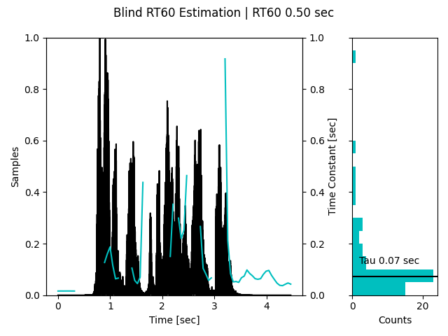

# BlindRT60
The Blind RT60 Estimation module, based on Ratnam et al.'s paper [1], estimates the reverberation time (RT60) for input audio signals in Python.
The evaluation of the BlindRT60 class involves using a speech utterance from the NOIZEUS database [2], which is a repository of a noisy speech corpus. 

[1] Ratnam, Rama & Jones, Douglas & Wheeler, Bruce & O'Brien, William & Lansing, Charissa & Feng, Albert. (2003). Blind estimation of reverberation time. The Journal of the Acoustical Society of America. 114. 2877-92. 10.1121/1.1616578. 

[2] Hu, Y. and Loizou, P. (2007). “Subjective evaluation and comparison of speech enhancement algorithms,” Speech Communication, 49, 588-601.

## Installation
```
pip install blind_rt60
```

## Basic Usage
```
from blind_rt60 import BlindRT60
from scipy.io import wavfile

# Create an instance of the BlindRT60 estimator
estimator = BlindRT60()

# Load your audio signal (x) and its sampling frequency (fs)
# Example: fs, x = wavfile.read("path/to/audio/file.wav")

# Estimate the RT60
rt60_estimate = estimator(x, fs)

# Visualize the results
fig = estimator.visualize(x, fs)
plt.show()
```

## Evaluation
The primary functionality of the BlindRT60 class was tested by simulating scenarios with different decay rates for generated decaying chirp signals and speech. The tests make use of the pyroomacoustics library to create a simulated room with a source and microphones, facilitating a comparison between the estimated RT60 using BlindRT60 and the RT60 calculated by the Schroeder method.

The provided figure illustrates the Blind RT60 Estimation, showcasing a speech trace, continuous decay rate estimation, and a histogram of estimated decay rates. 
<br/>



## Parameters
The BlindRT60 class accepts various parameters that allow customization of the estimation process. Here are the key parameters:

* fs: Sample rate of the audio signal.
* framelen: Length of each analysis frame in seconds.
* hop: Hop size between analysis frames in seconds.
* percentile: Pre-specified percentile value for RT60 estimation.
* a_init: Initial value for the decay rate parameter.
* sigma2_init: Initial value for the signal variance parameter.
* max_itr: Maximum number of iterations for convergence.
* max_err: Maximum error for convergence.
* a_range: Range of valid values for the decay rate parameter.
* bisected_itr: Number of iterations for the bisection method.
* sigma2_range: Range of valid values for the signal variance parameter.
* verbose: Enable verbose output for each iteration.

# Contributions
Contributions are welcome! If you find any issues or have suggestions for improvement, please open an issue or submit a pull request on the GitHub repository.

# Lisence
This project is licensed under the MIT License. See the LICENSE file for more information.

# Contact
For any inquiries or questions, please contact zoreasaf@gmail.com.


# Notes

## Model of Sound Decay
We assume that the reverberant tail of a decaying sound
y is the product of a fine structure x that is random process, and an envelope a that is deterministic. $x\left[ n \right]$ is independent and identically random variables drawn from the normal distribution $N\left( {0,\sigma } \right)$.
<br/>
The model for room decay then suggests that the observations y are specified by $y\left( n \right) = x\left( n \right) \cdot a\left( n \right)$.
Due to the time-varying term $a\left( n \right)$, $y\left( n \right)$ independent but not identically distributed, and their probability density function is $N\left( {0,\sigma  \cdot a\left( n \right)} \right)$.
<br/>
For each estimation interval the likelihood function of y is,
$$L\left( {y;a,\sigma } \right) = \frac{1}{{\prod\limits_{n = 0}^{N - 1} {a\left( n \right)} }} \cdot {\left( {\frac{1}{{2\pi {\sigma ^2}}}} \right)^{N/2}} \cdot \exp \left( { - \frac{{\sum\limits_{n = 0}^{N - 1} {{{\left( {\frac{{y\left( n \right)}}{{a\left( n \right)}}} \right)}^2}} }}{{2{\sigma ^2}}}} \right)$$
N+1 parameters of the model: $a\[0,...N\], \sigma$.
<br/>
Describe $a[n]$ by damped free decay $a\left[ n \right] = \exp \left( { - \frac{n}{\tau }} \right) \buildrel \Delta \over = {a^n}$,
$$L\left( {y;a,\sigma } \right) = {\left( {\frac{1}{{2\pi {a^{N - 1}}{\sigma ^2}}}} \right)^{N/2}} \cdot \exp \left( { - \frac{{\sum\limits_{n = 0}^{N - 1} {{a^{ - 2n}}y{{\left( n \right)}^2}} }}{{2{\sigma ^2}}}} \right)$$

## Maximum Likelihood Estimator
### Equations
Given the likelihood function, the parameters $a$ and $\sigma$ can be estimated using a maximum-likelihood approach,
$$\frac{{\partial \ln L\left( {y;a,\sigma } \right)}}{{\partial a}} = {a^{ - 1}}\left( {\frac{1}{{{\sigma ^2}}}\sum\limits_{n = 0}^{N - 1} {n \cdot {a^{ - 2n}}y{{\left( n \right)}^2} - \frac{{N\left( {N - 1} \right)}}{2}} } \right)$$
$$\frac{{{\partial ^2}\ln L\left( {y;a,\sigma } \right)}}{{\partial {a^2}}} = \frac{{N\left( {N - 1} \right)}}{2}{a^{ - 2}} + \frac{1}{{{\sigma ^2}}}\sum\limits_{n = 0}^{N - 1} {n\left( {1 - 2n} \right) \cdot {a^{ - 2n}}y{{\left( n \right)}^2}} $$
$$\frac{{\partial \ln L\left( {y;a,\sigma } \right)}}{{\partial \sigma }} =  - \frac{N}{\sigma } + \frac{1}{{{\sigma ^3}}}\sum\limits_{n = 0}^{N - 1} {{a^{ - 2n}}y{{\left( n \right)}^2}} $$
<br/>
* The geometric ratio is notably compressive, and in actual scenarios, the values of a are expected to be proximate to 1. Conversely, $\sigma$ exhibits a broad range. 
* Examining the gradient of $\frac{{\partial \ln L\left( {y;a,\sigma } \right)}}{{\partial a}}$, initiating the process with an initial value smaller than a requires the root-solving strategy to descend the gradient fast enough.

### Solution
* Solved using numerical and iterative approach $\frac{{\partial \ln L\left( {y;a,\sigma } \right)}}{{\partial a}} = 0$; $\frac{{\partial \ln L\left( {y;a,\sigma } \right)}}{{\partial \sigma }} = 0$.
* Estimating $a*$:
	1. The root was bisected until the zero was bracketed.
	2. The Newton–Raphson method was applied to accurate the root, ${a_{n = 1}} = {a_n} - \frac{{\frac{{\partial \ln L\left( {y;{a_n},\sigma } \right)}}{{\partial a}}}}{{\frac{{{\partial ^2}\ln L\left( {y;{a_n},\sigma } \right)}}{{\partial {a^2}}}}}$.
* Estimating $\sigma$:
	$${\sigma ^2} = \frac{1}{N}\sum\limits_{n = 0}^{N - 1} {{a^{ - 2n}}y{{\left( n \right)}^2}}$$

## Strategy for Assigning the Correct Decay Rate

The model will fail during (1) estimation frames that do not fall within a region of free decay, and (2) sound with a gradual rather than rapid offset.

* In the first case, the damping of sound in a room cannot occur at a rate faster than the free decay. A robust strategy would be to select a threshold value such that the left tail of the probability density function of $a*$.
* In the second case, $p(a^*)$ is likely to be multimodal. the strategy then is to select the first dominant peak.
* For a unimodal symmetric distribution with $\gamma = 0.5$ the filter will track the peak value, i.e., the median. In connected speech, where peaks cannot be clearly discriminated or the distribution is multi-modal, $\gamma$ should peaked based on the statistics of gap durations.


